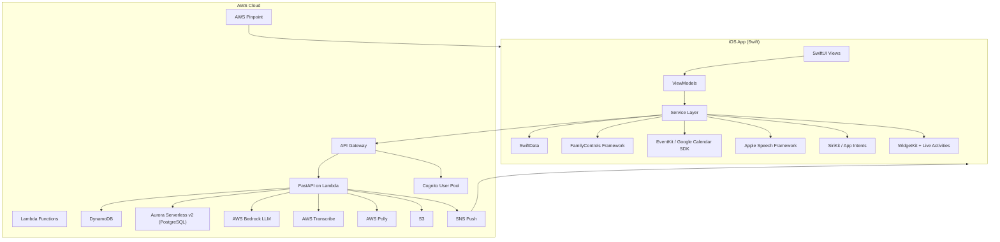
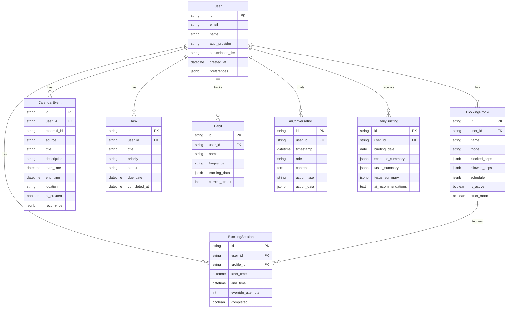
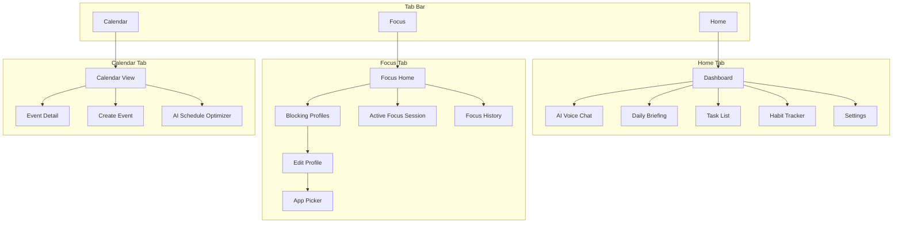
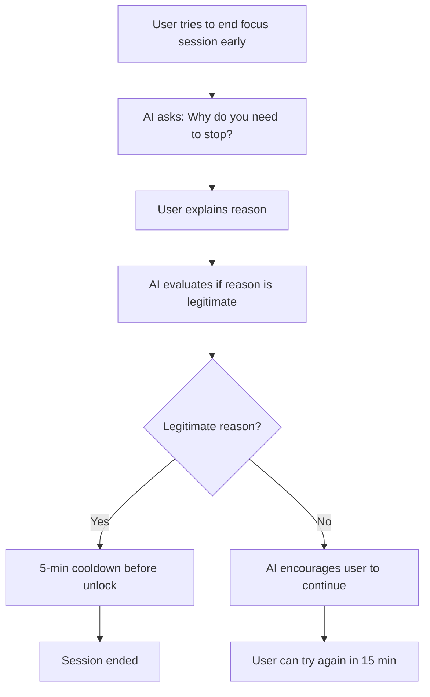
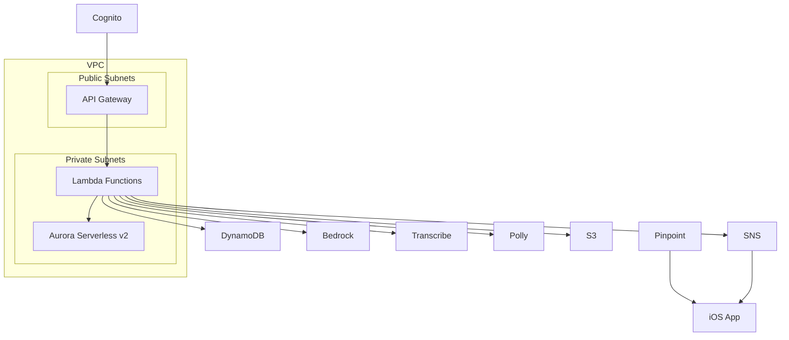

# BetterSelf -- Product Design Document & Development Plan

## Overview

**BetterSelf** (working title) is an iOS productivity app that combines two core pillars:

1. **Intelligent App Blocking** -- Uses Apple's FamilyControls / ManagedSettings / DeviceActivity frameworks with an AI accountability gatekeeper that manages blocking on the user's behalf (replacing the "friend who holds the Screen Time passcode" pattern)
2. **Voice-First AI Secretary** -- A professional AI assistant that manages calendars (Apple Calendar + Google Calendar), schedules events via natural language, optimizes schedules, tracks habits, and delivers daily briefings

### Target Audience

General productivity-focused users -- professionals, students, entrepreneurs, and anyone looking to take control of their time.

### Monetization: Freemium

- **Free tier:** Limited AI queries per day (e.g., 10), basic blocking (1 focus profile, daily limits), Apple Speech recognition
- **Premium tier ($X/month):** Unlimited AI interactions, advanced blocking (unlimited profiles, cold turkey mode, strict mode), detailed analytics/insights, high-quality AWS voice (Transcribe + Polly), meeting prep

### Team & Timeline

- **Team:** 2 developers
- **Timeline:** 2-3 months to MVP

---

## Architecture Overview



### Tech Stack

| Layer | Technology | Rationale |
|-------|-----------|-----------|
| Frontend | Swift + SwiftUI | Native iOS, best FamilyControls support |
| State Management | Combine + @Observable | Modern Swift concurrency |
| Local Storage | SwiftData | Offline cache for calendar, blocking rules |
| App Blocking | FamilyControls / ManagedSettings / DeviceActivity | Only way to block apps on iOS |
| Calendar | EventKit (Apple) + Google Calendar REST API | Two most popular calendars |
| Voice (free) | Apple Speech Framework | On-device, free, decent quality |
| Voice (premium) | AWS Transcribe + Polly | Higher accuracy, natural voices |
| Backend | Python (FastAPI) on AWS Lambda | Fast development, great AI library ecosystem |
| API Layer | API Gateway + Lambda (Mangum adapter) | Serverless, scales automatically |
| Auth | AWS Cognito | Supports email/password + Apple + Google sign-in |
| Database (sessions/real-time) | DynamoDB | User sessions, blocking rules, AI conversation history |
| Database (structured) | Aurora Serverless v2 (PostgreSQL) | Calendar events, analytics, user profiles (NOTE: final choice to be revisited during infrastructure milestone) |
| AI/LLM | AWS Bedrock (Claude/Titan) | Managed, stays in AWS, flexible model choice |
| Push Notifications | AWS SNS + APNs | Daily briefings, schedule reminders |
| Analytics | AWS Pinpoint | In-ecosystem, user engagement tracking |
| Infrastructure | AWS CDK (Python) | IaC, reproducible, team is experienced |
| CI/CD | GitHub Actions + Xcode Cloud | Automated builds and deployments |

---

## Data Models



### DynamoDB Tables

| Table | Partition Key | Sort Key | Purpose |
|-------|--------------|----------|---------|
| Users | user_id | - | User profiles, preferences, subscription status |
| BlockingProfiles | user_id | profile_id | Blocking rules and schedules |
| BlockingSessions | user_id | start_time | Focus session history and analytics |
| AIConversations | user_id | timestamp | Conversation history with the AI |

### Aurora PostgreSQL Tables

| Table | Purpose |
|-------|---------|
| calendar_events | Synced calendar events with recurrence support |
| tasks | Task management with priority and status |
| habits | Habit definitions and tracking data |
| daily_briefings | Generated daily summaries |
| analytics | Aggregated usage analytics for insights |

---

## App Screens & Navigation

### 3-Tab Structure



### Key Screens

**Home / Dashboard**
- Today's summary card: next event, active focus session, task count
- Quick-action buttons: start focus, talk to AI
- Habit streak display
- AI daily briefing card
- Greeting with time-of-day awareness

**AI Voice Chat**
- Large push-to-talk mic button (center of screen)
- Voice waveform animation while listening/responding
- Conversation history (scrollable)
- Action confirmation cards ("I've scheduled your gym for 6 PM -- confirm?")
- Text input fallback for quiet environments
- Siri Shortcuts integration for hands-free access

**Focus Home**
- Current session status with circular timer
- Quick-start buttons for saved profiles
- Today's screen time stats (total time, blocked attempts)
- Recent session history

**Profile Editor**
- Profile name and icon
- App picker (using FamilyControls `FamilyActivityPicker`)
- Schedule configuration (days, start/end times)
- Mode selector: Timed, Cold Turkey, Allowlist
- Strict mode toggle (enables AI gatekeeper)
- Cooldown/override settings

**Active Focus Session**
- Full-screen circular countdown timer
- Motivational messaging (rotates)
- Blocked app attempts counter
- Emergency override button (triggers AI gatekeeper in strict mode)
- Breathing animation background

**Calendar View**
- Month / week / day toggle
- Color-coded events by source (Apple blue, Google red, AI-created purple)
- Floating "+" button for new events
- AI schedule optimizer accessible from toolbar

**Settings**
- Account management
- Notification preferences (granular toggles)
- Calendar connections (Apple, Google)
- Subscription management
- AI voice quality toggle (Apple vs AWS)
- Theme preferences
- Privacy & data management

---

## Key Feature: AI Accountability Gatekeeper

When strict mode is enabled and a user tries to override a blocking session, the AI acts as a gatekeeper:



**Legitimate reasons (AI approves):** Genuine emergency, work-related urgent need, scheduled break time, physical safety concern

**Non-legitimate reasons (AI denies):** Boredom, "just want to check something quick," social media FOMO, vague reasons

The AI uses prompt engineering to be firm but encouraging. The 5-minute cooldown on approved overrides prevents impulsive unlocking.

---

## AI Secretary Capabilities

### Natural Language Actions

The AI secretary understands natural language commands and maps them to calendar/task actions:

| User Says | AI Action |
|-----------|-----------|
| "Schedule gym 3 times this week" | Creates 3 calendar events, finds optimal time slots based on existing schedule |
| "What does my day look like?" | Generates daily briefing with schedule, tasks, and focus recommendations |
| "Move my 2pm meeting to Thursday" | Reschedules event, checks for conflicts |
| "I need to finish the report by Friday" | Creates a task with Friday deadline, suggests focus sessions |
| "Block social media during work hours" | Creates/updates a blocking profile for Mon-Fri 9am-5pm |
| "When's the best time to go for a run?" | Analyzes schedule gaps, weather (if available), and suggests optimal times |

### Daily Briefing

Generated each morning (configurable time) and delivered via push notification + in-app card:

1. **Schedule overview:** Key events and meetings for the day
2. **Task priorities:** Top 3 tasks ranked by urgency/importance
3. **Focus recommendation:** Suggested focus sessions based on schedule gaps
4. **Habit check-in:** Which habits are due today, current streaks
5. **AI insights:** Patterns noticed (e.g., "You're most productive in the morning -- I've scheduled your deep work then")

### Schedule Optimization

The AI analyzes the user's calendar to:
- Identify overbooked days and suggest rescheduling
- Group similar meetings to reduce context switching
- Protect deep work blocks from being fragmented
- Suggest breaks between back-to-back meetings
- Balance workload across the week

---

## Design Language

- **Inspiration:** Headspace (calming, rounded corners, friendly) -- but NOT orange
- **Primary palette:** Soft blues (#5B8DEF), lavender purples (#9B8FE8), teals (#4ECDC4) on light backgrounds (#F8F9FA); dark mode with deep navy (#1A1B2E) and charcoal (#2D2D3F)
- **Typography:** SF Pro Rounded -- matches Headspace's friendly feel while staying native iOS
- **Corner radius:** 16-20pt for cards, 12pt for buttons, full rounding for pills/badges
- **Illustrations:** Minimal abstract blob shapes and soft gradients (calming, not childish)
- **Animations:** Smooth purposeful micro-animations
  - Breathing animation on the focus timer
  - Voice waveform during AI listening/speaking
  - Gentle card transitions and haptic feedback
  - Progress ring animations for streaks/goals
- **Spacing:** Generous padding (16-24pt), card-based layouts, no visual clutter
- **Shadows:** Soft, diffused shadows (2-4pt blur) for depth without harshness

---

## AWS Infrastructure



### Cost Estimates (MVP, low traffic)

| Service | Monthly Cost |
|---------|-------------|
| Lambda | ~$0-5 (free tier) |
| API Gateway | ~$0-3 |
| DynamoDB | ~$0-5 (on-demand) |
| Aurora Serverless v2 | ~$15-50 (scales to near-zero) |
| Bedrock | ~$10-50 (usage dependent) |
| Cognito | Free (up to 50k MAU) |
| Pinpoint | ~$0-5 |
| S3 | ~$0-1 |
| **Total** | **~$25-120/month** |

---

## Development Phases & Milestones

### Phase A: iOS App Foundation (Weeks 1-4)

| # | Milestone | Description | Duration |
|---|-----------|-------------|----------|
| 1 | Project Setup | Xcode project, Swift packages, folder structure, design system (colors, typography, components), CI setup | 3 days |
| 2 | Data Models & Local Storage | SwiftData models, mock data service, repository pattern | 2 days |
| 3 | Tab Navigation & Home Dashboard | 3-tab layout, dashboard with summary cards, settings shell | 3 days |
| 4 | Focus Mode UI | Profile list, profile editor, app picker (FamilyControls), active session screen with timer | 4 days |
| 5 | FamilyControls Integration | Request authorization, shield apps, DeviceActivity monitoring, schedule-based blocking | 5 days |
| 6 | Calendar UI | Month/week/day views, event detail, create event form | 4 days |
| 7 | Calendar Integration | EventKit (Apple Calendar) + Google Calendar API, sync engine | 4 days |
| 8 | AI Chat UI & Voice | Push-to-talk interface, Apple Speech recognition, conversation history, voice waveform | 4 days |

### Phase B: AWS Infrastructure (Weeks 4-6)

| # | Milestone | Description | Duration |
|---|-----------|-------------|----------|
| 9 | AWS CDK Foundation | VPC, subnets, security groups, base CDK stacks | 2 days |
| 10 | Auth Infrastructure | Cognito user pool (email + Apple + Google), API Gateway with Cognito authorizer | 2 days |
| 11 | Database Setup | DynamoDB tables + Aurora Serverless v2 cluster, CDK definitions | 2 days |
| 12 | Lambda & API Gateway | FastAPI project structure, Mangum adapter, deploy pipeline, health checks | 2 days |
| 13 | AI & Voice Services | Bedrock integration, Transcribe + Polly setup, prompt engineering for secretary persona | 3 days |

### Phase C: Backend API (Weeks 6-8)

| # | Milestone | Description | Duration |
|---|-----------|-------------|----------|
| 14 | User & Auth API | Registration, login, profile CRUD, subscription status | 2 days |
| 15 | Blocking Rules API | CRUD for blocking profiles, session logging, sync endpoints | 2 days |
| 16 | Calendar API | Event CRUD, sync with external calendars, AI-created event management | 3 days |
| 17 | AI Secretary API | Conversation endpoint, natural language -> calendar actions, schedule optimization, daily briefing generation | 4 days |
| 18 | Voice Processing API | Audio upload -> Transcribe -> LLM -> Polly -> audio response pipeline | 3 days |
| 19 | Tasks & Habits API | Task CRUD with prioritization, habit tracking, streak calculation | 2 days |
| 20 | Push Notifications | SNS setup, APNs integration, daily briefing scheduler, focus reminders | 2 days |

### Phase D: Integration (Weeks 8-10)

| # | Milestone | Description | Duration |
|---|-----------|-------------|----------|
| 21 | Auth Integration | Cognito SDK in Swift, sign-in flows, token management, secure storage | 2 days |
| 22 | API Client & Sync | Swift API client, offline queue, background sync, error handling | 3 days |
| 23 | AI Integration | Connect voice chat to backend AI, streaming responses, action confirmation flow | 3 days |
| 24 | Blocking Sync | Sync blocking profiles/sessions with backend, analytics data upload | 2 days |
| 25 | Calendar Sync | Two-way sync between local and cloud calendars, conflict resolution | 3 days |

### Phase E: Widgets, Polish & Launch (Weeks 10-12)

| # | Milestone | Description | Duration |
|---|-----------|-------------|----------|
| 26 | iOS Widgets | Home screen widgets (next event, focus timer, daily progress), WidgetKit implementation | 3 days |
| 27 | Live Activities | Lock screen focus session timer, Dynamic Island support | 2 days |
| 28 | Siri Shortcuts | App Intents for "schedule event", "start focus", "what's my day look like" | 2 days |
| 29 | Onboarding Flow | Guided setup screens (goals, schedule, app selection, calendar connection, AI introduction) | 3 days |
| 30 | Polish & Accessibility | Animations, haptics, VoiceOver support, Dynamic Type, edge cases | 3 days |
| 31 | Testing & QA | Unit tests, UI tests, integration tests, TestFlight beta | 3 days |
| 32 | App Store Submission | Screenshots, App Store listing, privacy policy, FamilyControls entitlement application, review submission | 3 days |

---

## Post-MVP Feature Roadmap

Features identified during planning to be added after initial launch:

1. **Proactive AI Suggestions** -- Location/time/schedule-aware cards that surface recommendations without the user asking (uses CoreLocation, time-of-day, and schedule context)
2. **Social Features** -- Accountability partners, shared focus sessions, friend streak visibility
3. **Gamification** -- Streaks, points, levels, badges, weekly challenges
4. **Apple Watch App** -- Focus timer on wrist, quick AI voice commands, haptic break reminders
5. **Customizable AI Personas** -- Let users choose tone: strict coach, friendly buddy, neutral assistant
6. **Advanced Analytics Dashboard** -- Detailed screen time trends, productivity scores, weekly/monthly reports with visualizations
7. **Siri Conversational Shortcuts** -- Deeper Siri integration for multi-turn conversations via App Intents

---

## iOS App Folder Structure

```
BetterSelf/
├── BetterSelf.xcodeproj
├── BetterSelf/
│   ├── App/
│   │   ├── BetterSelfApp.swift
│   │   ├── AppDelegate.swift
│   │   └── ContentView.swift
│   ├── Core/
│   │   ├── Design/
│   │   │   ├── Theme.swift
│   │   │   ├── Colors.swift
│   │   │   ├── Typography.swift
│   │   │   └── Components/
│   │   ├── Models/
│   │   │   ├── User.swift
│   │   │   ├── BlockingProfile.swift
│   │   │   ├── CalendarEvent.swift
│   │   │   ├── Task.swift
│   │   │   ├── Habit.swift
│   │   │   └── AIConversation.swift
│   │   ├── Services/
│   │   │   ├── AuthService.swift
│   │   │   ├── APIClient.swift
│   │   │   ├── BlockingService.swift
│   │   │   ├── CalendarService.swift
│   │   │   ├── AIService.swift
│   │   │   ├── SpeechService.swift
│   │   │   └── NotificationService.swift
│   │   └── Storage/
│   │       ├── SwiftDataContainer.swift
│   │       └── KeychainManager.swift
│   ├── Features/
│   │   ├── Home/
│   │   │   ├── HomeView.swift
│   │   │   ├── HomeViewModel.swift
│   │   │   ├── DailyBriefingCard.swift
│   │   │   └── QuickActionsView.swift
│   │   ├── AIChat/
│   │   │   ├── AIChatView.swift
│   │   │   ├── AIChatViewModel.swift
│   │   │   ├── VoiceInputView.swift
│   │   │   └── MessageBubble.swift
│   │   ├── Focus/
│   │   │   ├── FocusHomeView.swift
│   │   │   ├── FocusViewModel.swift
│   │   │   ├── ProfileEditorView.swift
│   │   │   ├── AppPickerView.swift
│   │   │   ├── ActiveSessionView.swift
│   │   │   └── FocusHistoryView.swift
│   │   ├── Calendar/
│   │   │   ├── CalendarView.swift
│   │   │   ├── CalendarViewModel.swift
│   │   │   ├── EventDetailView.swift
│   │   │   └── CreateEventView.swift
│   │   ├── Onboarding/
│   │   │   ├── OnboardingFlow.swift
│   │   │   └── OnboardingSteps/
│   │   └── Settings/
│   │       ├── SettingsView.swift
│   │       └── SubscriptionView.swift
│   └── Extensions/
├── BetterSelfWidgets/
│   ├── FocusTimerWidget.swift
│   ├── NextEventWidget.swift
│   └── DailyProgressWidget.swift
├── BetterSelfIntents/
│   └── AppIntents.swift
└── Tests/
```

## Backend Folder Structure (Python + CDK)

```
backend/
├── infrastructure/
│   ├── app.py
│   ├── cdk.json
│   ├── requirements.txt
│   └── stacks/
│       ├── vpc_stack.py
│       ├── auth_stack.py
│       ├── database_stack.py
│       ├── api_stack.py
│       ├── ai_stack.py
│       └── notifications_stack.py
├── api/
│   ├── main.py
│   ├── requirements.txt
│   ├── routers/
│   │   ├── auth.py
│   │   ├── users.py
│   │   ├── blocking.py
│   │   ├── calendar.py
│   │   ├── ai.py
│   │   ├── voice.py
│   │   ├── tasks.py
│   │   └── habits.py
│   ├── models/
│   │   ├── user.py
│   │   ├── blocking.py
│   │   ├── calendar.py
│   │   └── ai.py
│   ├── services/
│   │   ├── ai_service.py
│   │   ├── calendar_service.py
│   │   ├── voice_service.py
│   │   └── notification_service.py
│   └── utils/
│       ├── auth.py
│       └── config.py
└── tests/
```

---

## Risk Areas & Mitigations

| Risk | Impact | Mitigation |
|------|--------|-----------|
| FamilyControls entitlement approval delayed | Cannot ship app blocking | Apply during Phase A. Build accountability/nudge UI as fallback. |
| Voice latency (AWS round-trip 3-5s) | Poor UX for voice interaction | Use Apple Speech on-device for transcription, send text to Bedrock, Polly only for response. Show "thinking" animation. |
| Google Calendar OAuth verification | Cannot integrate Google Calendar | Start Google Cloud Console verification early (can take weeks). Ship with Apple Calendar first if delayed. |
| Database choice uncertainty | Over/under-engineering data layer | Start with DynamoDB only for MVP. Add Aurora only if complex relational queries emerge. Revisit in Milestone 11. |
| Bedrock model availability/cost | AI features too expensive | Implement token budgeting per user tier. Use smaller models for simple actions, larger for complex reasoning. |
| App Store review rejection | Launch delay | Review Apple's guidelines early, especially for FamilyControls. Prepare appeals documentation. |

---

## Privacy & Security

- All data encrypted at rest (AWS default encryption) and in transit (TLS 1.3)
- Cognito handles auth tokens; refresh tokens stored in iOS Keychain
- Calendar data: user explicitly grants EventKit permission; Google Calendar uses OAuth scopes limited to calendar read/write
- FamilyControls: user must explicitly authorize; app cannot access which specific apps are installed, only shield selected categories/apps
- AI conversations: stored in DynamoDB with user_id partition; users can delete conversation history
- Voice audio: processed in real-time, not stored (transcribed text is stored as part of conversation)
- GDPR/privacy: data export and account deletion endpoints in the API
- No data sold to third parties
